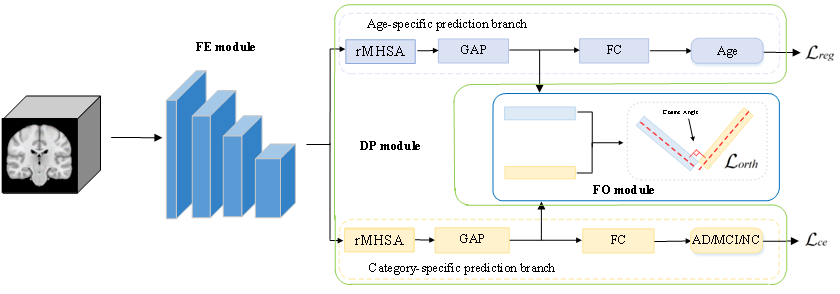
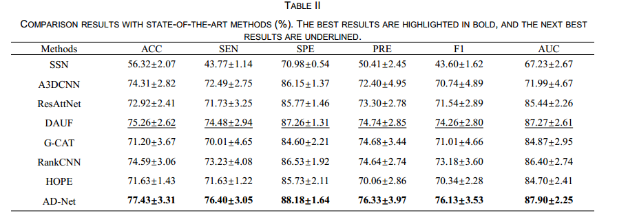
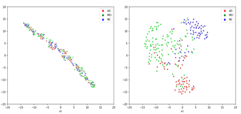
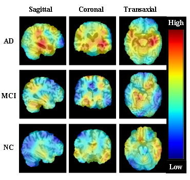

# Disentangling Normal and Pathological Brain Atrophy for the Diagnosis of Mild Cognitive Impairment and Alzheimer’s Disease

*Authors: Y. Shou, L. Gao, Z. Zhang et al.*

## Table of Contents

1. [Introduction](#introduction)
2. [Models](#models)
3. [Results](#results)
4. [Get Started](#getstarted)

## Introduction <a name="introduction"></a>

This research aims to address the early diagnosis of Alzheimer's Disease (AD) and Mild Cognitive Impairment (MCI). AD is a chronic neurodegenerative disease that starts insidiously and develops progressively. MCI, the prodromal stage of AD, impairs memory and cognitive function, potentially leading to AD. Structural magnetic resonance imaging (sMRI), as a non-invasive imaging technology, can clearly display the detailed morphology of brain tissues like the hippocampus and cortex, making sMRI images ubiquitous in AD and MCI diagnosis. However, neurologists face challenges in promptly and accurately identifying disease stages from sMRI images, limited by human visual observation and the relatively small size of abnormalities. Given their unlimited visual observation range, computers provide significant opportunities for enhancing the accuracy of computer-aided AD and MCI diagnosis. Convolutional neural networks (CNNs) have gained interest in sMRI image classification for computer-aided AD and MCI diagnosis. 

we propose a novel atrophy disentanglement network (AD-Net), designed to decouple age-related normal and disease-specific pathological atrophy features from sMRI images for AD and MCI diagnosis. Our AD-Net consists of a feature extraction (FE) module, a dual-task prediction (DP) module, preliminarily disentangling these two types of features, and a feature orthogonality (FO) module, further separating the two types of features to enhance classification performance. Our proposed framework is depicted as below.



## Model Implementations and Weights <a name="models"></a>

To assess the reliability and robustness of AD-Net, we employ 5-fold cross-validation for all experiments. We repeat the 5-fold cross-validation process three times and calculate the mean and standard deviation of the validation set outcomes as the final results.Below are the sections containing the code for different experimental models:

1.[Code for ADNet Model](./disentangle_model/disentangle_mhsa.py)

2.[Code for Attention Model](./disentangle_model/attention)

3.[Code for Ablation Model](./disentangle_model/FE)

4.[Download ADNet Model Weights](https://pan.baidu.com/s/1NQnPHZ2LjT41zLQcF3Bbkw?pwd=2345)

## Results <a name="results"></a>

### 1.Comparison results with state-of-the-art methods



### 2. t-SNE visualization for (a) pre-processed sMRI images and (b) features extracted by AD-Net. The red, green, and blue points represent AD, MCI, and NC subjects, respectively.



### 3. Network interpretability visualization using gradient-weighted class activation map (Grad-CAM). The colorbar reflects the levels of attention that our AD-Net allocates to different brain regions during label prediction. Red signifies regions where AD-Net focuses more attention, blue denotes regions of lesser attention, and the gradual change from blue to red represents increasing levels of attention paid by AD-Net. The three lines from top to bottom display slices from sMRI images labeled as AD, MCI, and NC, respectively, each accompanied by its individual heatmaps. The first, middle, and last columns show the slices of each sMRI image from sagittal, coronal, and transaxial views, respectively.



## Get Started <a name="getstarted"></a>

### 1. Downloading datasets from ADNI path.

All sMRI images are screened at the baseline timepoint using 1.5T scanners following the T1-weighted MPRAGE protocol. Table I presents the demographic and clinical information of these subjects. The website is [ADNI](https://adni.loni.usc.edu/).

### 2. Data preprocessing

For data preprocessing, we adopt the pipeline involving skull stripping, dura and neck removal, and affine registration using the tool of [FMRIB](https://fsl.fmrib.ox.ac.uk/). The affine registration aligns all sMRI images with the MNI152 template. Subsequently, we normalize all the sMRI images with the dimensions 160 × 160 × 160. Finally, we normalize the voxel values of all the sMRI image into the range 0 to 1.
Next, generate a CSV file containing the paths of all brain images, along with their corresponding labels (e.g., 0 for AD, 1 for MCI, 2 for NC).

### 3. Training code.

```python
python train.py
```

### 4. Testing code.

```python
python evaluate.py
```

### 6. Folder structure

```python
adnet_code
  ├─ disentangle_model
  │   ├─ attention
  │   ├─ FE
  │   └─ disentangle_mhsa.py
  ├─ evaluate
  │   ├─ evaluate.py
  │   └─ until.py
  ├─ gardcam
  │   ├─ gard_cam.py
  │   └─ my_utils_2.py
  ├─ results
  │   ├─ gard-cam.png
  │   ├─ SOTA.PNG
  │   └─ T-SNE.png
  ├─AD-NET.png
  ├─README.md
  ├─requirements.txt
  ├─train.py
  ├─t-sne.py
  └─until.py
```


### Acknowledgments

We gratefully thank the **ADNI**  investigators for providing access to the data.
